# Benthic Fish Detection

> This website is new and still under development, but please email daniel {at} mardascience {dot} com and I would be happy to talk with you!

We develop a machine vision system for automated enumeration and sizing of in-
dividual benthic fish in underwater imagery. The system consists of 1) a single-pass
probabilistic object-detector model to find candidate regions where fish are likely to
be present, followed by 2) an image segmentation model to estimate the outline of
each individual fish. The system is applied to enumerating Round Goby (Neogobius
melanostomus) in Drop-camera as well as Autonomous Underwater Vehicle (AUV) in
imagery from Lake Michigan, USA. We find that a model cascade is advantageous over
applying a single model for the task. Both model outputs include an associated prob-
ability of detection. Hence the dual-model implementation provides two performance
metrics; a probability of fish identification and bounding box location which is useful
for error reporting for fish counts, and a separate probability of fish pixels, which is
additionally useful for error reporting for fish biomass. 
The computational efficiency of the system is designed for on-board
quantification of fish in real-time.

### "Noisy" RetinaNet
RetinaNet (Figure below) is a popular one-stage object detector, partly because it uses a
feature pyramid network to efficiently detect objects at multiple scales. Traditionally, image
pyramids have been used to detect objects with varying scales in an image, using feature
engineering practices (e.g. from HOG, Haar wavelets, etc), however this process is compute
and memory intensive. However, that practice has now been largely superceded by image
pyramiding based on hierarchical convolutional filters, called Featurized image pyramids.
The CNNs layers used have an inherently pyramidal hierarchy, and the model frameworks
are fully convolutional, which can takes an image of an any size and output proportionally
sized feature maps at multiple levels. RetinaNet uses a Feature Pyramid Network (FPN) built on top of ResNet-50
from which the final fully connected classification layer has
been removed, in a fully convolutional fashion to extract features at three spatial scales (and
corresponding pixel resolution). This feature extractor is referred to as the ‘backbone’ of
the model. In our implementation, we modify the backbone such that random
Gaussian noise is added to all three feature maps output by the backbone.

An FPN is used in conjunction with the backbone for constructing a multi-scalar feature
pyramid from an input image at a single resolution. This is achieved by connecting each of
the three ResNet-50 output feature maps at different scales (the bottom-up convolutional
layers in Figure below) with lateral connections to a top-down pathway that upsamples the
spatially coarser feature maps from higher pyramid levels. The lateral connections are used
to merge the top-down layers and the bottom-up layers with the same pixel size. The FPN
facilitates object detection at a range of scales.

The top-down pathway upsamples the spatially coarser feature maps from higher pyramid
levels, with residual (lateral) connections that merge the layers with the same spatial size. At
each of the prediction levels, there is a regression subnetwork, which estimates the precise
location of the bounding box of each fish, and a classification subnetwork that uses the
output of the coupled backbone-FCN to predict the probability of goby presence at each
spatial position

Each detection is probabilistic; a threshold probability is used to filter detections and is
used as a tunable parameter in model application. The framework for fish detection is based
on the RetinaNet model framework, based on a 3-layer feature pyramid network using a
ResNet-50 feature extractor. We modify the RetinaNet framework for the noisy underwater
environment by adding Gaussian noise to features extracted from imagery by ResNet-50. 

Noise is only added during training, not during model evaluation or when
the model is used to make predictions on new sample imagery. The model is regularized
by the Gaussian noise, and is designed to make the model robust to noisy underwater envi-
ronments. Forcing the model to detect fish in the presence of significant noise ensures that
overfitting to extracted image features is minimized

### GobyNet Schematic
GobyNet model schematic, consisting of a bottom-up pathways that uses image
pyramiding to extract features at a hierarchy of levels, joined using residual connections to a
top-down pathway that merge the extracted features into a set of features that are passed to
both a classification and a regression subnetwork. The classification subnetwork determines
the class of the object and its likelihood, and the regression subnetwork estimates the corners
of the bounding box that surrounds the object.

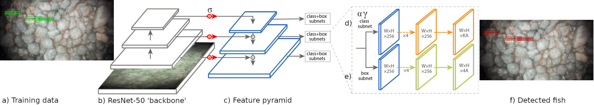

### Training 
Focal loss is a modification to the classical cross-entropy loss criterion for situations
where there is large class imbalance. Class imbalance in this scope means that only a small
proportion of any given scene are occupied by fish, even if Gobies are congregated in relatively
large clusters of up to a dozen of so individuals, owing to the small size of the fish with respect
to the large AUV image scene.

Effect of varying γ (a) and α (b) on Focal Loss. The effect of increasing γ is to reduce the relative loss for a given p , disproportionately for p > .5. The effect of decreasing α is to reduce the relative loss for a given p , disproportionately for p < .5.

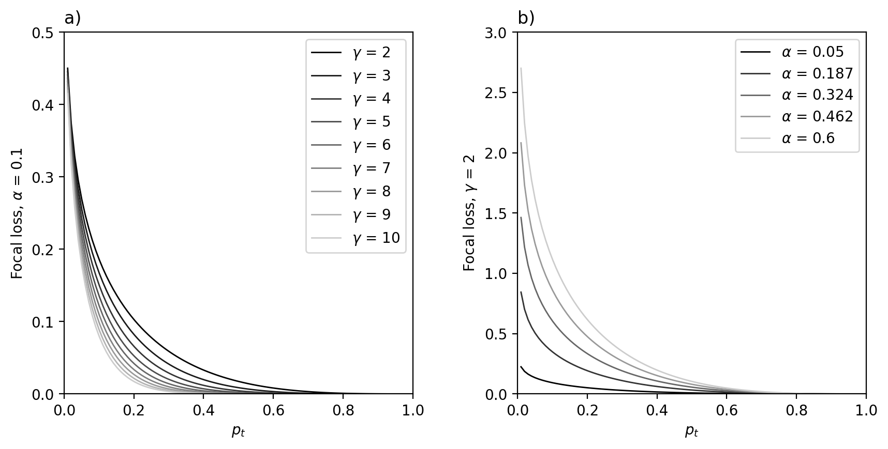

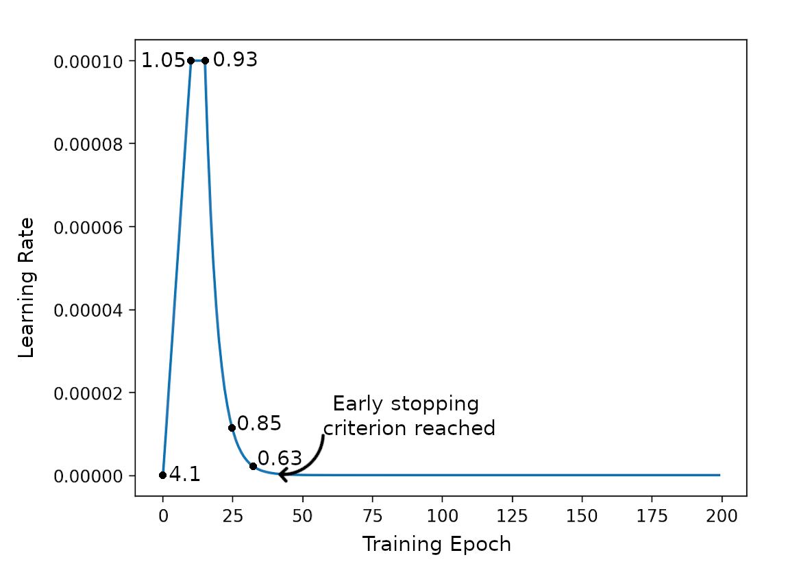

### Performance
Example AUV imagery with gobies identified by green bounding boxes (these examples are some from the model training set

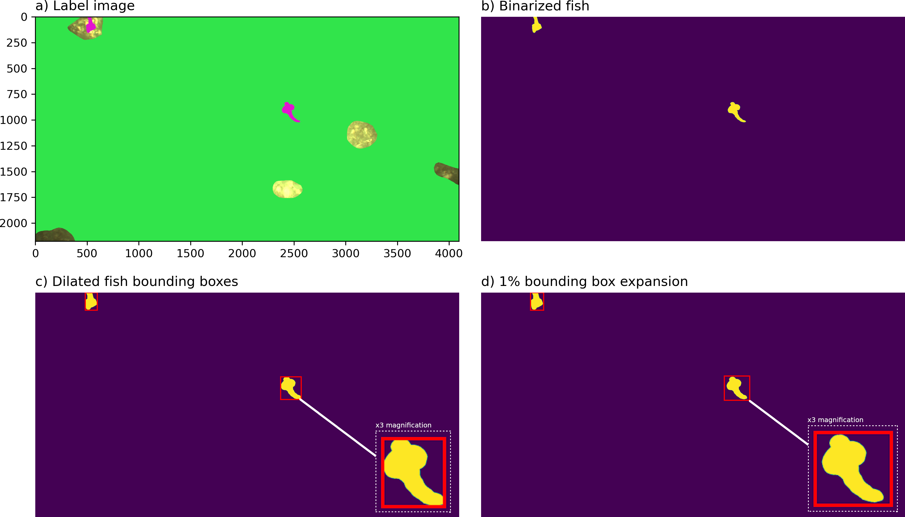

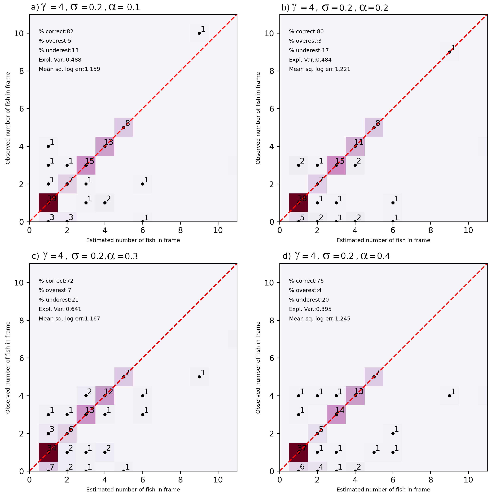

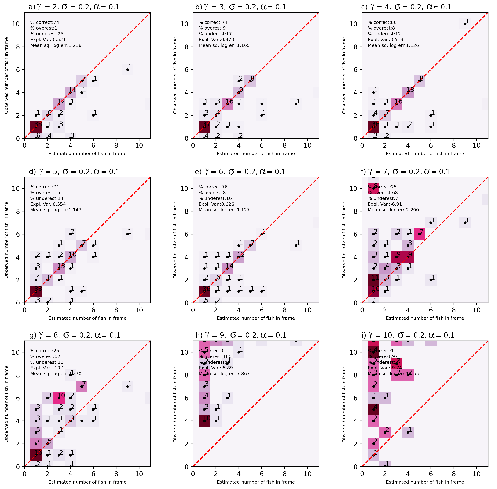

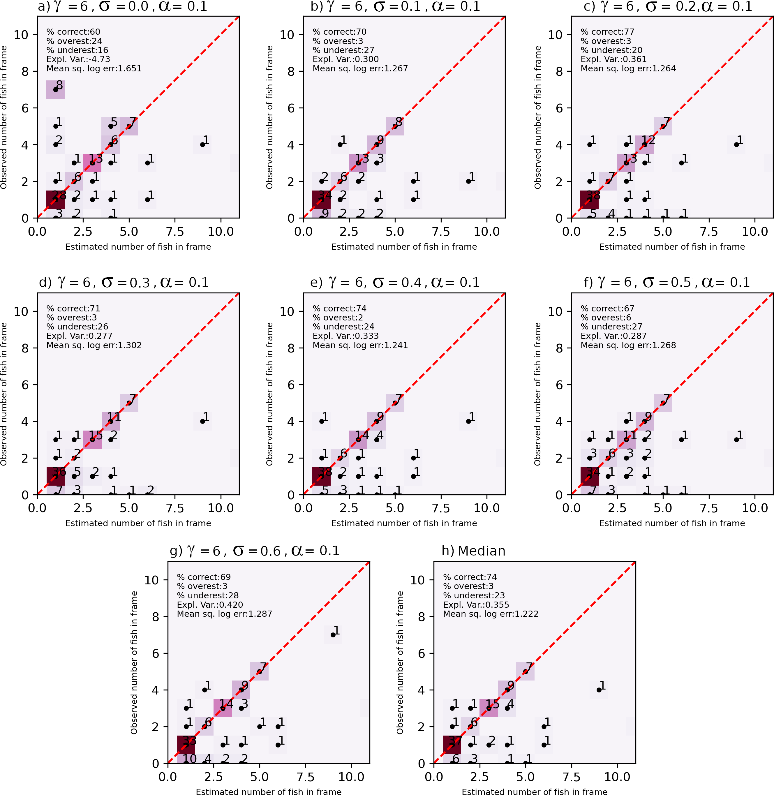

### Residual U-Net for Fish Detection
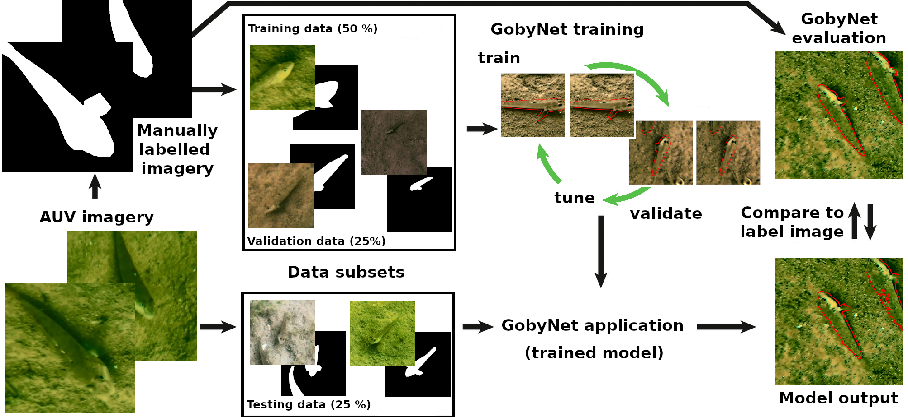

### Training Data
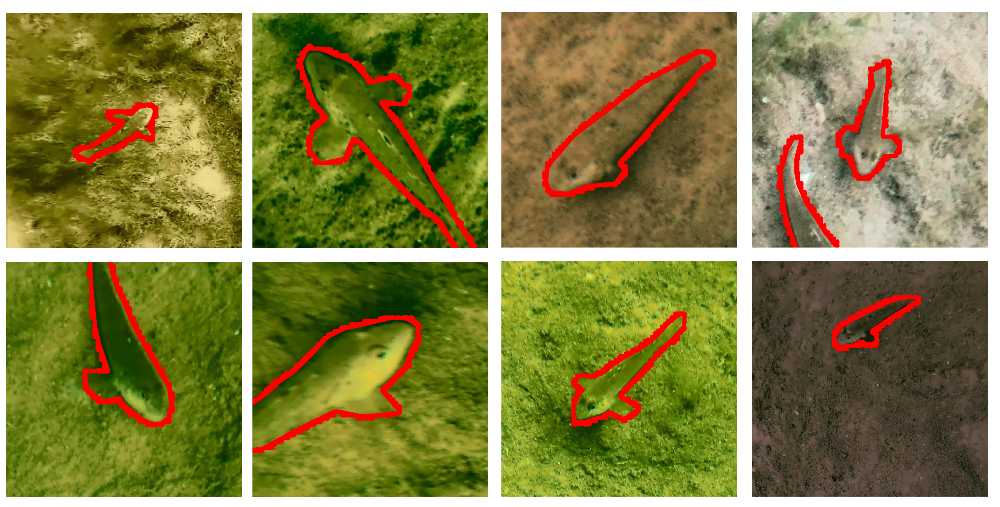

### Performance
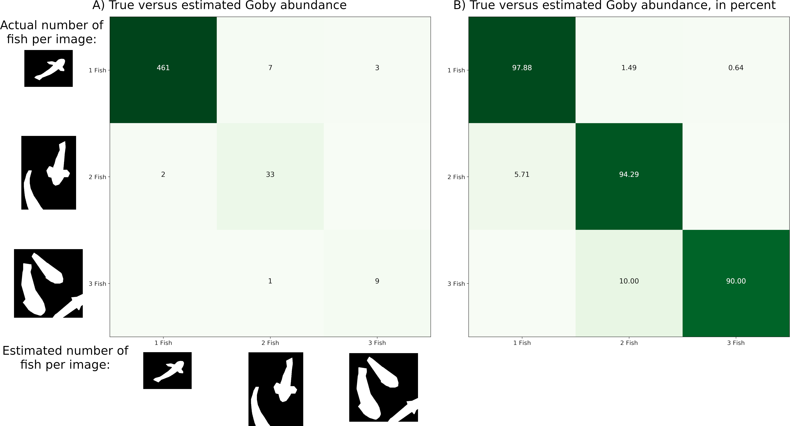

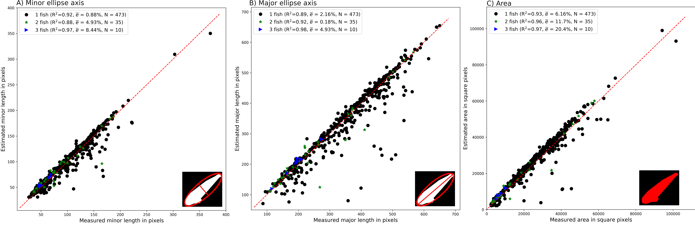

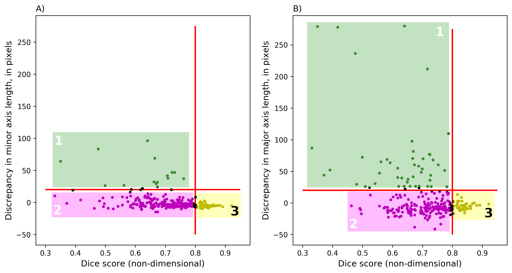