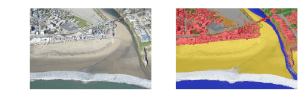
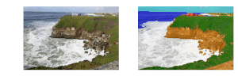

# Image Segmentation

This website is new and still under development, but please email daniel {at} mardascience {dot} com and we'd be happy to talk with you!

[Here is a recent presentation](https://docs.google.com/presentation/d/1SlIXFUfL4Nxu2R40pXW406gUZ4_MkRlWeyyh3i5GvpI/edit#slide=id.p) I gave showing an overview of some of my recent work (view in presentation mode)

### Aerial imagery

#### Water / no water

USGS PlaneCam (west coast) RGB imagery:

#### Water / sand / vegetated / developed

NOAA Emergency Reconnaissance (RGB) imagery:

#### Water / surf / sand / vegetated / developed

USGS PlaneCam (west coast) RGB imagery:

### Satellite imagery

#### Water / whitewater / sand / other

Sentinel-2 RGB imagery at Duck, North Carolina:

#### Water / whitewater / sand / other

Landsat-8 RGB imagery at Ventura, California:

#### Shoreline trends 

at Agate Beach near Patricks Point, northern CA:

### Webcam imagery

