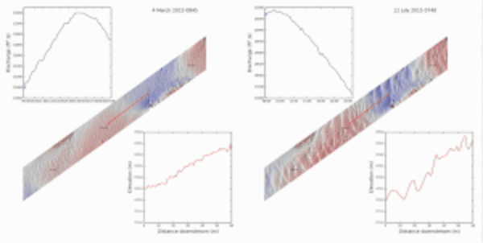

# Sonar mapping

> This website is new and still under development, but please email daniel {at} mardascience {dot} com and I would be happy to talk with you!

### Sonar imagery

Habitat mapping using multispectral backscatter. Runner up of the 2018 R2Sonic Multispectral Backscatter Competition at GeoHab Conference, Santa Barbara.

See the [code here](https://github.com/dbuscombe-usgs/prism)

### Bedform migration and bedload sediment transport

