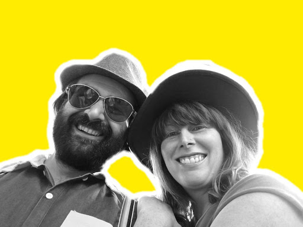
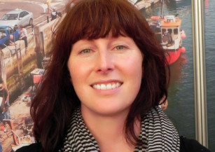
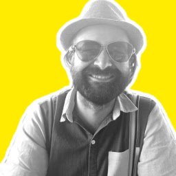

# Hi, we're Maria and Dan ...



... and we're a science consultancy. This website is new and still under development, but please email daniel / maria {at} mardascience {dot} com and we'd be happy to talk with you!

While we 'get our act together' as we migrate from website external hosting to self-hosting (blog post [here](../blog/this-website)), here is a brief summary of our respective skills and experiences:

## Dr Maria Campbell



I am a science writer, editor, communicator, and advocate for social and environmental justice in STEM.

Everyone has a story to tell. My story is one of an unconventional scientific career; one that has led me from human physiology to creating an award-winning ocean science film with kids from the high desert. I aspire to be a scientist who consistently engages with the public, in particular, our youth with creative visual content.
I am a marine scientist who has been working in research for 15 years, and I am passionate about connecting people to the natural world. I am a dedicated science communicator and writer, with experience at high profile institutions like the BBC and London Student, Europe's most widely read grassroots student magazine. For the past five years, I have been also been working in the nonprofit sector as a fundraiser and outreach and campaign strategist. I have experience in developing curricula for K-12, undergraduates and postgraduates. I also love fish.

## Dr Dan Buscombe



I am a data scientist and quantitative geomorphologist. I work on problems related to how we apply and use new and/or large data sets and computational techniques to applied problems in geomorphology, ecology, oceanography, and hydrology. This work involves:
* Investigating how we re-purpose existing instrumentation capabilities to measure additional properties of interest in natural environments
* Algorithm and model development to develop proxies between remotely sensed signals and physical (and biological) properties
* Research into machine learning and inverse methods, data simulation, fusion, and assimilation
* Coding; my "techstack" includes python, tensorflow, keras, opencv, GDAL, conda, git, bash, cython, C++, fortran, matlab, latex, markdown, nginx/gunicorn, unix, linux, HPC, slurm, Google Cloud

A lot of this work has been supported by the US Geological Survey and other governmental agencies, working on applied river and coastal geomorphology while at the USGS Grand Canyon Monitoring and Research Center in Flagstaff, AZ (2012-2016), then at Northern Arizona University (2016-2020), and now as a contractor for the USGS Pacific Coastal and Marine Science Center (PCMSC) in Santa Cruz, CA. Prior to that, I carried out post-doctoral research at PCMSC (2008-2009) and did my PhD (2004-2008) and yet more post-doctoral research (2009-2012) at the University of Plymouth, UK, in the (then) School fo Marine Science and Engineering.

I have always worked in aquatic (freshwater, coastal and marine) systems, combining field, theoretical, and experimental approaches to the field of sediment transport, hydrodynamics, and computational eco-hydro-sediment acoustics and optics. I specialize in developing data-driven methods, principally for monitoring sedimentary systems such as alluvial rivers, lake beds, and coastal environments. These methods take some form of data, such as a photograph from a conventional camera, an underwater hologram, or echogram from a multibeam sonar, and extracts some extra type of information that makes the pursuit of collecting such data for environmental monitoring and research. Examples of projects where I have done this include (often in multiple applied contexts to add value to public-funded research):

* Estimating grain size of sediment from photographs (several methods)
* Estimating sediment facies and bethic substrate mapping from sidescan and multibeam sonar (several methods)
* Estimating ocean wave height and period, and wave breaker type, from photographs of beach surf zones
* Estimating land cover / use, coastal morphologies and habitats from photographs (several methods)
* Discovering and tracking objects (e.g. buildings, fish, people) in photographs

<!-- This understanding is applied to developing systems for monitoring river and coastal water and sediment, in order to address problems in river and coastal engineering and management, including hazards (floods, storms, tsunami, and landslides), river and sedimentation engineering, dam and reservoir management, water resources and wastewater management, treatment of contaminated sediments, engineering problems in ports and harbors, river restoration, beach nourishment, dredging activities, and renewable hydro-power projects. -->

In the past several years I have developed expertise in Machine Learning and Deep Learning techniques (branches of data science that contribute to AI or Artificial Intelligence applications) and my full-time focus is the automation and application of these techniques to environmental data analysis and data extraction, and much of this work involves mining large spatiotemporal remotely sensed data, such as from satellites, aircraft missions, or sonar.

I research how to make methods robust to large-scale application, and re-purposing toward multiple objectives. Deep Learning is especially useful for this; through my work, I am demonstrating that Deep Learning models can be successfully repurposed to tens to hundreds of individual similar tasks on similar data sets. I am thereby developing 'Design Patterns' for the use of AI for certain types of automated environmental information extraction pipelines.


## We combine ...

... over our passion for education and training, our desire to serve traditional underserved populations, and our advocacy for open science, built on open-source code and practices, and findable, accessible, interoperable and reusable data.


<!-- Let's discover **Docusaurus in less than 5 minutes**.

## Getting Started

Get started by **creating a new site**.

Or **try Docusaurus immediately** with **[new.docusaurus.io](https://new.docusaurus.io)**.

## Generate a new site

Generate a new Docusaurus site using the **classic template**:

```shell
npx @docusaurus/init@latest init my-website classic
```

## Start your site

Run the development server:

```shell
cd my-website

npx docusaurus start
```

Your site starts at `http://localhost:3000`.

Open `docs/intro.md` and edit some lines: the site **reloads automatically** and display your changes. -->
